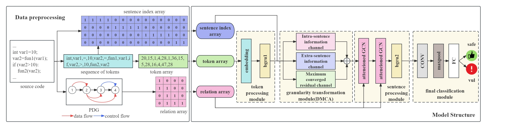

## DMCAVD: A Double-side Mask Converged Attention Based Vulnerability Detection Modle

With the development of software technology, vulnerability detection technology 
is playing an increasingly important role in software security. Currently, there 
are numerous deep learning based vulnerability detection algorithms. However, 
most of these algorithms focus on features of a specific granularity, which makes 
it challenging to effectively integrate features of other granularities. To address 
the problem of integrating program features with different granularities, this paper 
introduces a Double-side Mask Converged Attention (DMCA) structure for feature 
granularity transformation. Based on this structure, we propose a vulnerability 
detection model that integrates program features of different granularities. This 
model performs well in both artificial synthetic datasets and real datasets, 
demonstrating higher accuracy than state-of-the-art models. In addition, this paper 
uses Grad-CAM to track the model gradient and record the contribution of each token 
to the classification result. Through statistical analysis, we found which tokens 
are the key to trigger vulnerabilities.

In summary, this article makes the following contributions:

1.  We propose a model structure called Double-side Mask Converged Attention(DMCA), 
which enables vulnerability detection algorithms to integrate features of different 
granularities by achieving feature granularity transformation.

2.  We attach an attention mechanism to GCN and obtain a more effective feature fusion 
structure, Attentiond-GCN. Combining this structure with DMCA,we design an end-to-end 
vulnerability detection model called DMCAVD.

3. We demonstrate that the comprehensive performance of DMCAVD is better than that SOTA 
models through comparative experiments, and demonstrate the effectiveness of structures 
such as DMCA and attentioned-GCN through ablation experiments.

4.  We use the grad-CAM algorithm to analyze the gradient relationship of the whole 
model from token to result.  Through statistical analysis, we have identified the key 
tokens that trigger vulnerabilities.

## Design of DMCAVD
 

DMCAVD consists of five main phases:
1. Code feature extraction: We first convert the code into a digital sequence composed 
of token indexes through word2vec to obtain the token-array, and then generate the 
binary matrix of the row in which the token is recorded according to the sequence and 
the source code to obtain the sentence-index-array. Finally, the adjacency matrix 
representing the dependencies between sentences is generated according to the PDG 
analyzed by Joern, and the relation-array is obtained.
2. Token processing: We adopt a combined structure of embedding layer and feature fusion. 
Such a structure can not only follow the model training, but also supplement the missing 
semantic information through feature fusion. Considering that the subsequent transformer like 
structure requires location information, we use BGRU as the structure for token-grained feature 
fusion after the embedding layer.
3. Granularity transformation: We transform the token-granularity information into the 
sentence-granularity information discriminably through the three parallel channels in 
Double-side Mask Converged Attention(DMCA) structure.
4. Sentence processing: We use enhanced Graph Convolutional Network(GCN): attentioned-GCN 
to fuse the code-dependent features extracted by Program Dependence Graph(PDG) to obtain a 
sentence representation matrix that integrates control and data dependence.
5. Classification: We designed a classifier consisting of convolutional layer, pooling layer 
and fully connected layers. After multi-channel feature fusion, pooling and mapping, finally 
we can get a 0-1 number as the result, indicating the probability of vulnerability.

## Source Code

#### Step 1: Code standardization
Standardize the code with standardization.py (This operation will overwrite the data file, please make a backup)
```
cd preprocess
python ./standardization.py -i ../dataset/sard
```

#### Step 2: Generate pdgs with the help of joern
Prepare the environment refering to: [joern](https://github.com/joernio/joern)
In order to avoid problems cause by version, we update the cli-version we used.
```
# first generate .bin files
python joern_graph_gen.py  -i ../dataset/sard/Vul -o ../dataset/sard/bins/Vul -t parse
python joern_graph_gen.py  -i ../dataset/sard/No-Vul -o ../dataset/sard/bins/No-Vul -t parse


# then generate pdgs (.dot files)
python joern_graph_gen.py  -i ../dataset/sard/bins/Vul -o ../dataset/sard/pdgs/Vul -t export -r pdg
python joern_graph_gen.py  -i ../dataset/sard/bins/No-Vul -o ../dataset/sard/pdgs/No-Vul -t export -r pdg
```

#### Step 3: Train a sent2vec model
```
trainWord2Vect.py -i ../dataset/sard/Corpus -o ../model/wordModelSard -d 128
```

#### Step 4: Generate images from the pdgs
Generate Images from the pdgs with ImageGenerationNew.py, this step will output a .pkl file for each .dot file.
```
python ImageGenerationNew.py -d ../data/sard/pdgs/Vul -c ../dataset/sard/Vul -o ../dataset/sard/outputs/Vul -m ../model/wordModelSard
python ImageGenerationNew.py -d ../data/sard/pdgs/No-Vul -c ../dataset/sard/No-Vul -o ../dataset/sard/outputs/No-Vul -m ../model/wordModelSard
```

#### Step 5: Integrate the data and divide the training and testing datasets
Integrate the data and divide the train, val and test datasets with pklGenNew.py, this step will output a train.pickle, a val.pickle and a test.pickle file.
```
# "tr" means train rate and "vr" means val rate, the rest are collected in test. "-tr 0.8 -vr 0.1" means train:val:test=8:1:1
python pklGenNew.py -v ../dataset/sard/outputs/Vul -n ../dataset/sard/outputs/No-Vul -o ../dataset/sard/pkls -tr 0.8 -vr 0.1
```

#### Step 6: Train with DMCAVD
```
cd ..
# "wm" means work mode, you can choose train or test
# If "train" is chosen, "-tr", "-v", "-te" mean the path of train, val and test dataset. "-s" is the save path of models,"-e" is the train epoch
python DMCA.py -wm train -tr ./dataset/sard/pkls/train.pickle -v ../dataset/sard/pkls/val.pickle -te ./dataset/sard/pkls/test.pickle -s ./model/sard/ -e 100
# If "test" is chosen, we only need to feed "-te". Then "-l" is the path for model weight to be loaded.
python DMCA.py -wm test -te ./dataset/sard/pkls/test.pickle -l ./model/sard/model-test.hdf5
```
